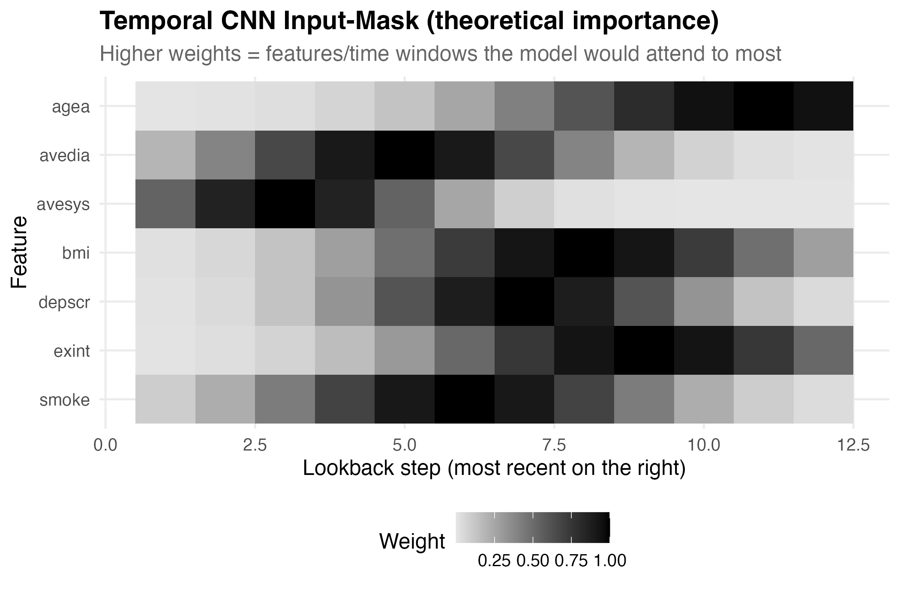
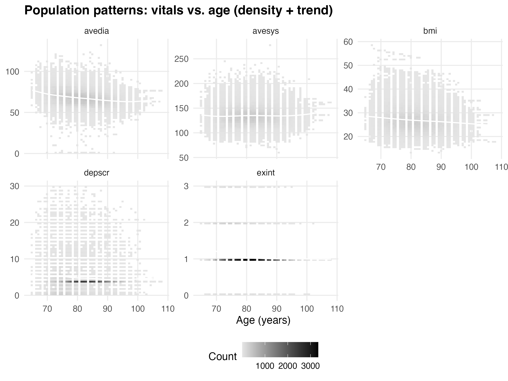

# CHS Risk Factor Forecasting — Quadratic Hazard & Temporal CNN Masks

This project illustrates two complementary ideas for cardiovascular event forecasting on CHS-style longitudinal data:
1) a **quadratic hazard** view (SDE-inspired Bayesian hierarchy) that makes risk-factor *optimization* interpretable, and  
2) a **Temporal CNN with an input mask** that provides in-model importance across features × time.

---

##  Highlights (Visuals)

### 1) Quadratic Hazard (Theoretical Optimization)
A simple illustration of a quadratic log-hazard in systolic BP with an **argmin** (the “risk-reducing target”).

*Why it matters:* communicates how a Bayesian hierarchical SDE framework can **optimize modifiable factors** toward a target that minimizes failure risk.

---

### 2) Temporal CNN Input-Mask (Theoretical)
A synthetic heatmap showing **feature × lookback** importance the model could learn (e.g., strongest recent attention to BP, mid-term to smoking, etc.).

*Why it matters:* conveys **in-model** importance (not post-hoc) and how your masked-input CNN drives forecasts.

---

### 3) Population Patterns: Vitals vs Age
Small multiples (density + smooth trend) for cohort orientation.

---

## 🧠 Methods at a Glance
- **Quadratic hazard:** \(\log h(x)=\beta_0+\beta_1 x+\beta_2 x^2\). The argmin \(-\beta_1/(2\beta_2)\) is an interpretable risk target for optimization.
- **Temporal CNN + Mask:** learnable mask highlights influential **features × lags** used by the CNN, yielding stable, in-model importance.

---

